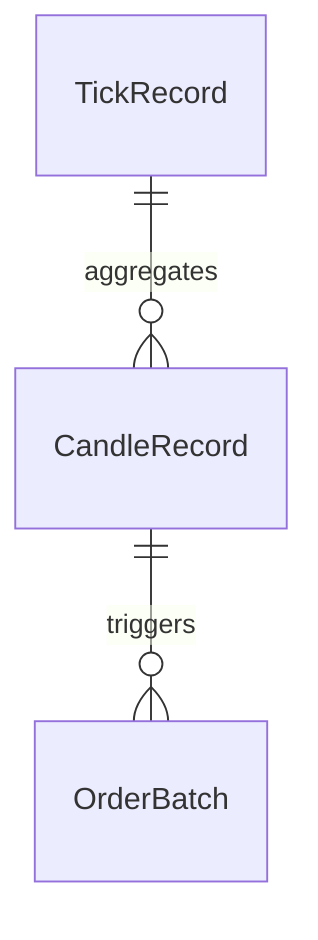

# Data Model – Ratio Trades V3

In dit document beschrijven we de kernentiteiten en hun velden die door de POC worden gebruikt.

## 1. Tick Record

Een individuele tick zoals ontvangen van de WebSocket of CSV-replay.

| Veld       | Type      | Omschrijving                                                   |
|------------|-----------|----------------------------------------------------------------|
| timestamp  | string    | ISO-8601 timestamp in CET (e.g., `2025-07-07T10:00:00+02:00`). |
| symbol     | string    | Handelsparen, bijv. `THETA-USDT` of `TFUEL-USDT`.              |
| price      | float     | Slotkoers van de tick.                                         |
| volume     | float     | Verhandeld volume in de tick.                                  |
| nk         | int       | Aantal ticks sinds start buffer (counter).                     |
| bestBid    | float    | (Optioneel) Hoogste biedprijs in orderbook.                     |
| bestAsk    | float    | (Optioneel) Laagste vraagprijs in orderbook.                    |

## 2. Candle Record

Een samengevatte periode-candle, verrijkt met indicatoren.

| Veld         | Type      | Omschrijving                                             |
|--------------|-----------|----------------------------------------------------------|
| timestamp    | string    | Begin van de candle in ISO-8601 CET.                     |
| open         | float     | Openingskoers.                                           |
| high         | float     | Hoogste koers.                                           |
| low          | float     | Laagste koers.                                           |
| close        | float     | Slotkoers.                                               |
| volume       | float     | Totale volume in de periode.                             |
| rsi          | float     | Relative Strength Index.                                 |
| sma9_price   | float     | 9-periodes Simple Moving Average van de prijs.           |
| ema_9        | float     | 9-periodes Exponential Moving Average van de prijs.      |
| lower_band   | float     | Onderste Bollinger Band (SMA - stddev * σ).              |
| upper_band   | float     | Bovenste Bollinger Band (SMA + stddev * σ).              |
| ratio_lower  | float     | `close / lower_bollinger_band`.                          |
| ratio_upper  | float     | `close / upper_bollinger_band`.                          |

## 3. Order Batch Record

Representeert een suborder in de batching-logica.

| Veld            | Type    | Omschrijving                                                      |
|-----------------|---------|-------------------------------------------------------------------|
| batch_id        | int     | Unieke identificatie van de batch (volgnummer).                   |
| side            | string  | Type order: `SWAP_TFUEL_TO_THETA` of `SWAP_THETA_TO_TFUEL`.       |
| amount_in       | float   | Ingangshoeveelheid (in base token).                               |
| price_effective | float   | Gebruikte prijs (eventueel met slippage).                         |
| fee_amount      | float   | Berekende fees over deze batch.                                   |
| amount_out      | float   | Netto hoeveelheid verkregen na fee.                               |
| timestamp       | string  | UTC timestamp van order-simulatie in ISO-8601-formaat.            |

## 4. Relaties

- **TickRecord → CandleRecord**: meerdere ticks vormen één candle.
- **CandleRecord → OrderBatch**: voor elke candle berekent de strategie batches.

## 5. Ratio Record

Een speciaal record dat de verhouding tussen TFUEL- en THETA-prijzen vastlegt.

| Veld          | Type   | Omschrijving                                                  |
|---------------|--------|---------------------------------------------------------------|
| timestamp     | string | ISO-8601 timestamp in CET van de ratio-berekening.            |
| symbol_pair   | string | Handelsparencombinatie, bijv. `TFUEL-THETA`.                  |
| theta_price   | float  | Slotkoers van THETA-USDT op dat moment.                       |
| tfuel_price   | float  | Slotkoers van TFUEL-USDT op dat moment.                       |
| ratio         | float  | Berekening: `tfuel_price / theta_price`.                      |
