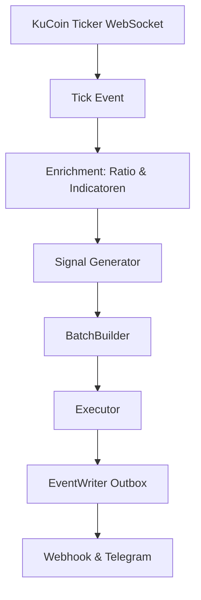

# 📊 Ratio-BB-POC – Live Pipeline Datamodel

**Status:** 2025-07-14  
**Versie:** 1.0  
**Doel:** Uniforme beschrijving van alle data-objecten in de live trading pipeline

---

## 🗺️ Overzicht Dataflow

---

## 🧩 Datamodel Per Stap

### 1️⃣ KuCoin Ticker Event (bron)

| Veld        | Type    | Beschrijving |
|-------------|---------|--------------|
| `symbol`    | str     | Bijvoorbeeld 'THETA-USDT' |
| `price`     | float   | Laatste prijs |
| `time`      | int     | Epoch tijd in ms |

---

### 2️⃣ Internal Tick Event

| Veld        | Type    | Beschrijving |
|-------------|---------|--------------|
| `symbol`    | str     | THETA-USDT / TFUEL-USDT |
| `price`     | float   | Laatste prijs |
| `timestamp` | str     | ISO8601 tijd |
| `volume`    | None    | Nog niet beschikbaar in ticker-feed |

---

### 3️⃣ Enrichment: Ratio & Indicatoren

| Veld        | Type    | Beschrijving |
|-------------|---------|--------------|
| `ratio`     | float   | TFUEL prijs / THETA prijs |
| `sma9`      | float   | SMA9 van de ratio |
| `bb_upper`  | float   | Bollinger Band Upper |
| `bb_lower`  | float   | Bollinger Band Lower |
| `bb_basis`  | float   | Bollinger Band Basis |

---

### 4️⃣ Signal Event

| Veld        | Type    | Beschrijving |
|-------------|---------|--------------|
| `symbol`    | str     | THETA-USDT of TFUEL-USDT |
| `price`     | float   | Laatste prijs |
| `timestamp` | str     | ISO8601 |
| `signal`    | str     | BUY / SELL / HOLD |
| `ratio_context` | dict | Ratio + indicator snapshot |

---

### 5️⃣ Batch Event

| Veld        | Type    | Beschrijving |
|-------------|---------|--------------|
| `batch_id`  | str     | Unieke batch-ID |
| `signals`   | list    | Lijst van signalen |
| `ratio`     | float   | Huidige ratio |
| `timestamp` | str     | Tijd van batch |
| `strategy_note` | str | Toelichting waarom deze batch |

---

### 6️⃣ Webhook / Telegram Event

| Veld        | Type    | Beschrijving |
|-------------|---------|--------------|
| `action`    | str     | BUY THETA / SELL THETA |
| `volume`    | float   | Omruilvolume (bijv. 15.000 TFUEL) |
| `ratio`     | float   | Huidige ratio |
| `timestamp` | str     | Tijd |
| `batch_id`  | str     | Batch referentie |
| `explanation` | str   | Uitleg over de trade |

---

## 🧭 Toekomstige uitbreidingen

- Tick-volume toevoegen via `match`-feed (optioneel)  
- Trend- of momentum-score als extra enrichment  
- Monitoring events voor performance / latency

---

**Status:**  
Dit datamodel is leidend voor de live trading pipeline van Ratio-BB-POC.