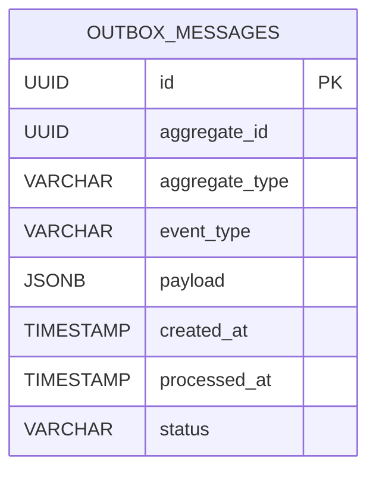

# Outbox Design Document

## Inleiding

Deze documentatie beschrijft het ontwerp van de Outbox-structuur zoals toegepast in het Ratio BB POC project. De Outbox-patronen worden gebruikt om betrouwbare berichtafhandeling te garanderen in gedistribueerde systemen. Dit document bevat een gedetailleerde uitwerking van de datastructuur, voorbeelden en ontwerpkeuzes.

---

## Outbox Structuur

De Outbox is een tabel die berichten opslaat die door een service worden geproduceerd en later worden gepubliceerd naar een berichtensysteem (bijvoorbeeld Kafka, RabbitMQ, etc.). Dit patroon zorgt ervoor dat berichten niet verloren gaan, zelfs als het systeem crasht na het opslaan maar vóór het versturen van het bericht.

### Tabel: outbox_messages

| Kolomnaam         | Type          | Omschrijving                                    |
|-------------------|---------------|------------------------------------------------|
| id                | UUID          | Unieke identifier van het bericht               |
| aggregate_id      | UUID          | Identifier van het aggregate waar het bericht bij hoort |
| aggregate_type    | VARCHAR(255)  | Type van het aggregate (bijv. "Order", "User")  |
| event_type        | VARCHAR(255)  | Type van het event (bijv. "OrderCreated")       |
| payload           | JSONB         | De daadwerkelijke data van het event             |
| created_at        | TIMESTAMP     | Timestamp waarop het bericht is aangemaakt       |
| processed_at      | TIMESTAMP     | Timestamp waarop het bericht is verwerkt/verzonden |
| status            | VARCHAR(50)   | Status van het bericht (bijv. "pending", "processed", "failed") |

---

## Voorbeeld SQL-schema

```sql
CREATE TABLE outbox_messages (
    id UUID PRIMARY KEY,
    aggregate_id UUID NOT NULL,
    aggregate_type VARCHAR(255) NOT NULL,
    event_type VARCHAR(255) NOT NULL,
    payload JSONB NOT NULL,
    created_at TIMESTAMP NOT NULL DEFAULT NOW(),
    processed_at TIMESTAMP NULL,
    status VARCHAR(50) NOT NULL DEFAULT 'pending'
);

CREATE INDEX idx_outbox_status ON outbox_messages(status);
CREATE INDEX idx_outbox_aggregate ON outbox_messages(aggregate_type, aggregate_id);
```

---

## Gebruik en Workflow

1. **Bericht aanmaken:** Wanneer een gebeurtenis zich voordoet binnen een aggregate, wordt er een nieuw bericht in de `outbox_messages` tabel geschreven met status `pending`.
2. **Bericht verwerken:** Een aparte outbox-verwerker leest berichten met status `pending` en publiceert deze naar het berichtensysteem.
3. **Status bijwerken:** Na succesvolle publicatie wordt de status van het bericht gewijzigd naar `processed` en wordt `processed_at` gezet.
4. **Foutafhandeling:** Indien publicatie mislukt, kan de status op `failed` worden gezet en kan er een retry-mechanisme worden toegepast.

---

## Voorbeeld code snippet (Python)

```python
import psycopg2
import json
from datetime import datetime

def insert_outbox_message(conn, aggregate_id, aggregate_type, event_type, payload):
    with conn.cursor() as cur:
        cur.execute("""
            INSERT INTO outbox_messages (id, aggregate_id, aggregate_type, event_type, payload)
            VALUES (gen_random_uuid(), %s, %s, %s, %s)
        """, (aggregate_id, aggregate_type, event_type, json.dumps(payload)))
    conn.commit()

def fetch_pending_messages(conn):
    with conn.cursor() as cur:
        cur.execute("""
            SELECT id, payload FROM outbox_messages WHERE status = 'pending' ORDER BY created_at
        """)
        return cur.fetchall()

def mark_message_processed(conn, message_id):
    with conn.cursor() as cur:
        cur.execute("""
            UPDATE outbox_messages SET status = 'processed', processed_at = %s WHERE id = %s
        """, (datetime.utcnow(), message_id))
    conn.commit()
```

---

## Dataschets



---

## Samenvatting

Deze outbox-structuur biedt een robuuste manier om events betrouwbaar op te slaan en te publiceren. Door gebruik te maken van een statusveld en tijdstempels kan het systeem eenvoudig berichten beheren en fouten afhandelen. Dit ontwerp ondersteunt schaalbaarheid en consistentie in gedistribueerde systemen.
